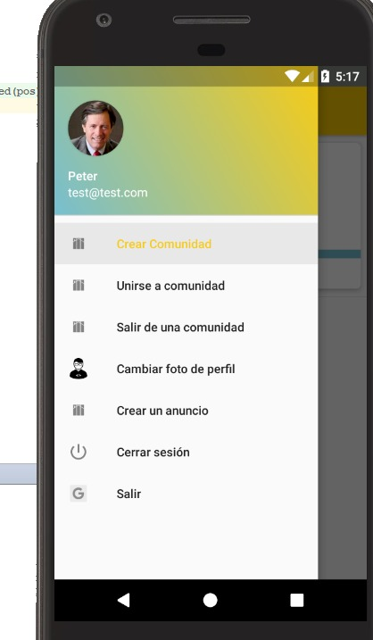
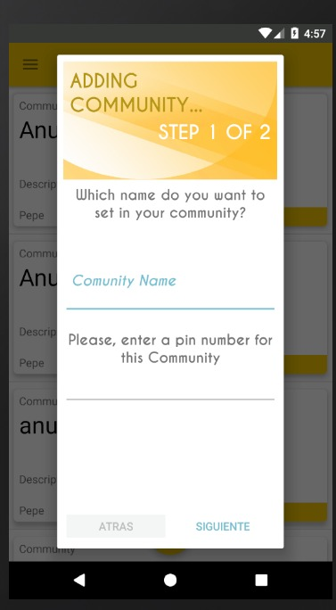

Es una App que resuelve las necesidades de una comunidad de vecinos que comparten servicios y que se conectan entre ellos y con otras comunidades.
Donde tu puedes realizar favores o pedir si pueden hacerte un favor.
Para poder pedir favores o realizar tienes que unirte a una comunidad, accediendo con la contraseña de la comunidad. Puedes unirte a varias comunidades y crear tus anunicios.
Los anuncios se diferencia por la categoria cuando crear el anuncio.

Es una App muy intuitiva y de uso fácil.

SPLASH APP & LAUNCHER
-----

        

HOW TO USE
----

Primero accederemos al menu arriba en la parte superior izquierda

Si queremos añadir una comunidad haremos click en "Crear Comunidad"

Si queremos añadir una anuncio haremos click en "Crear Anuncio" o podremos pulsar al boton fab en el tablon principal

Podremos unirnos tambien a una comunidad en "Unirse a Comunidad" donde introduciremos el pin de la comunidad en la que deseamos entrar

DOWNLOAD APP
-----

Ir a play store y buscar `COMMUNIFY` o `http:play_store...`.

Built With
-----

* [Android Studio](https://developer.android.com/studio/install.html) - La web para intalar android studio paso apaso.

## Contributing
-----

* [pdiez](https://github.com/pdiez) - Mix Master
* [RubenEscribanoMartin](https://github.com/RubenEscribanoMartin) - Designer
* [oscaruceda](https://github.com/oscaruceda) - Cloud Master
* [jergox](https://github.com/jergox) - Scrum Master